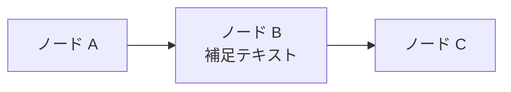
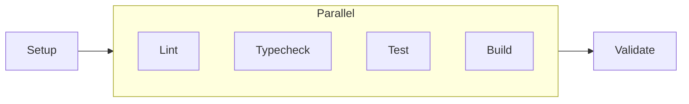
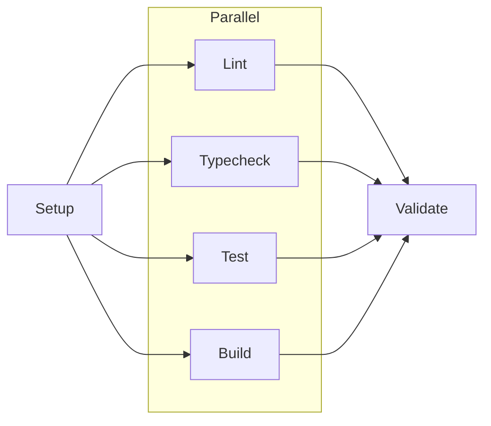
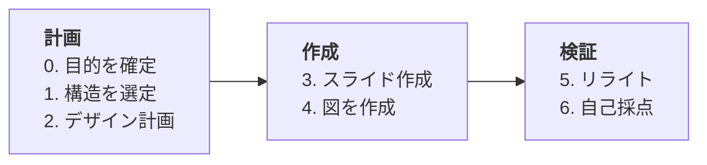

# Mermaid 図の作成ガイド

## ソースファイルを作成

`slides/diagrams/<図名>.mmd` に Mermaid 定義を書く。



**記法の注意点:**
- 改行は `<br/>` を使う（`\n` はリテラル表示される）
- **`flowchart LR`（横方向）を優先**する。`TD`（縦方向）はスライドに収まりにくい
- **横一列のノード数は最大 5 個**にする。6 個以上は関連ステップをグループ化して 1 ノードにまとめる（例: 10 ステップ → 4 フェーズに集約）
- subgraph 内のノード数は最小限にする（多いと縦に伸びる）
- 情報量が多い場合は 1 つのノードにテキストをまとめる
- **番号付き項目や複数行テキストを含むノードは左寄せ**にする。`htmlLabels: true`（デフォルト）の環境では `<div style='text-align:left'>` で囲む
- カスタム `style` 行は書かない（テーマ設定に任せる）

## 並列ノードのレイアウト（fan-out / fan-in パターン）

`flowchart LR` で並列実行されるノード群を表現する場合、**subgraph に一括接続せず、各ノードに個別接続**する。

### NG: subgraph に一括接続 → 内部ノードが横並びになる



- `direction TB` を指定しても、subgraph 一括接続だと Mermaid が横に並べてしまう
- LR フロー全体と同方向に横並びになるため、流れが読みにくい
- ノードが横に詰まるため文字が小さくなる

### OK: 各ノードに個別接続（fan-out / fan-in） → 縦に並ぶ



- `&` 記法で fan-out / fan-in を表現すると、Mermaid が自然に縦配置する
- 各ノードに十分な幅が確保され、文字が読みやすくなる
- subgraph は視覚的なグループ化（ラベル表示）の目的で残してよい

## 矢印方向の規約（依存関係図）

パッケージ構成やモジュール依存を示す図では、**`A --> B` は「A が B に依存する」を意味する**。

### 原則

1. 矢印は **依存元 → 依存先** の向きに引く
2. スライド本文中のテキスト表記 `→` も同じ規約に従う（例: `apps → core` = apps が core に依存）
3. `flowchart LR` の場合、依存元（アプリ層）が左、依存先（基盤層）が右に配置される

### 正例・誤例


### テキストとの整合性

スライド本文で矢印表記を使う場合、Mermaid 図と同じ方向であること:

| テキスト | 意味 | 整合性 |
|---------|------|--------|
| `apps → core の単方向設計` | apps が core に依存 | OK（図と一致） |
| `core → apps の単方向設計` | core が apps に依存 | NG（依存方向が逆） |

**ノードのグループ化と左寄せの例:**



- NG: 10 ノードを横一列 → 各ノードが小さく文字が読めない
- OK: 4 フェーズにグループ化 → 各ノードに十分な幅が確保される
- NG: 番号付き項目が中寄せ → 先頭の数字がガタガタで読みづらい
- OK: `text-align:left` で左寄せ → 先頭が揃って読みやすい

## SVG を生成

基本は一括生成コマンドを使う。

```bash
npm run marp:diagrams
```

これで各 `.mmd` から次の 2 ファイルが生成される:

- `slides/images/<図名>.svg`（通常テーマ向け）
- `slides/images/<図名>-midnight.svg`（`palette-midnight` 向け）

単体で生成確認したい場合は以下でもよい:

```bash
npx @mermaid-js/mermaid-cli \
  -i slides/diagrams/<図名>.mmd \
  -o slides/images/<図名>.svg \
  -b transparent \
  -c slides/diagrams/mermaid-config.json
```

テーマ設定 `slides/diagrams/mermaid-config.json` が存在しない場合はオプション `-c` を省略する。

## スライドに埋め込み

SVG は Markdown 画像 `` で直接貼らず、テーマ切替コンテナを使う。

```html
<div class="diagram-theme-switch" style="--diagram-width: 900px;">
  /<図名>.svg" alt="">
  /<図名>-midnight.svg" alt="">
</div>
```

`--diagram-width` が画像幅の目安になる。
`images-relative` は Markdown の配置に応じて選ぶ（`slides/*.md` は `images`、`slides/<dir>/*.md` は `../images`）。

- 横幅いっぱい: `--diagram-width: 1100px;`
- 標準: `--diagram-width: 800px;`
- コードブロックと同居: `--diagram-width: 500px;`〜`600px;`

生成した SVG を Read ツールで確認し、収まらない場合は幅を調整する。

## スマートサイジング（一括生成時）

`npm run marp:diagrams` で一括生成する場合、ファイル名のプレフィックスに応じてサイズが自動設定される。

### 命名規則

| プレフィックス | 想定される図 | 自動サイズ (幅x高) |
|--------------|------------|-------------------|
| `timeline-` | タイムライン図 | 2400x400 |
| `gantt-` | ガントチャート | 2400x400 |
| `architecture-` | アーキテクチャ図 | 2400x1600 |
| `system-` | システム構成図 | 2400x1600 |
| `workflow-` | ワークフロー図 | 2400x800 |
| `sequence-` | シーケンス図 | 2400x800 |
| (その他) | デフォルト | 1200x800 |

例: `slides/diagrams/workflow-ci-pipeline.mmd` → 2400x800 で自動レンダリング

### 環境変数でのオーバーライド

デフォルトサイズを環境変数で上書きできる:

```bash
MERMAID_WIDTH=1600 MERMAID_HEIGHT=1000 npm run marp:diagrams
MERMAID_SCALE=4 npm run marp:diagrams
```

| 環境変数 | デフォルト | 用途 |
|---------|-----------|------|
| `MERMAID_WIDTH` | 1200 | デフォルト幅（プリセット未適用時） |
| `MERMAID_HEIGHT` | 800 | デフォルト高さ（プリセット未適用時） |
| `MERMAID_SCALE` | 2 | レンダリング倍率（全図共通） |

### スライド埋め込み時の `![w:XXX]` 推奨値

| 図の種類 | 推奨幅 | 備考 |
|---------|--------|------|
| タイムライン / ガント | `w:1100` | 横長なので幅いっぱいに |
| アーキテクチャ / システム | `w:800`〜`w:900` | 高さがあるため幅を抑える |
| ワークフロー / シーケンス | `w:900`〜`w:1000` | 中程度の横幅 |
| その他 | `w:800` | 標準サイズ |
